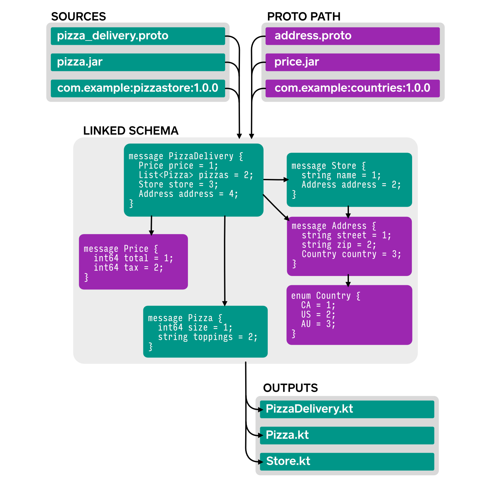
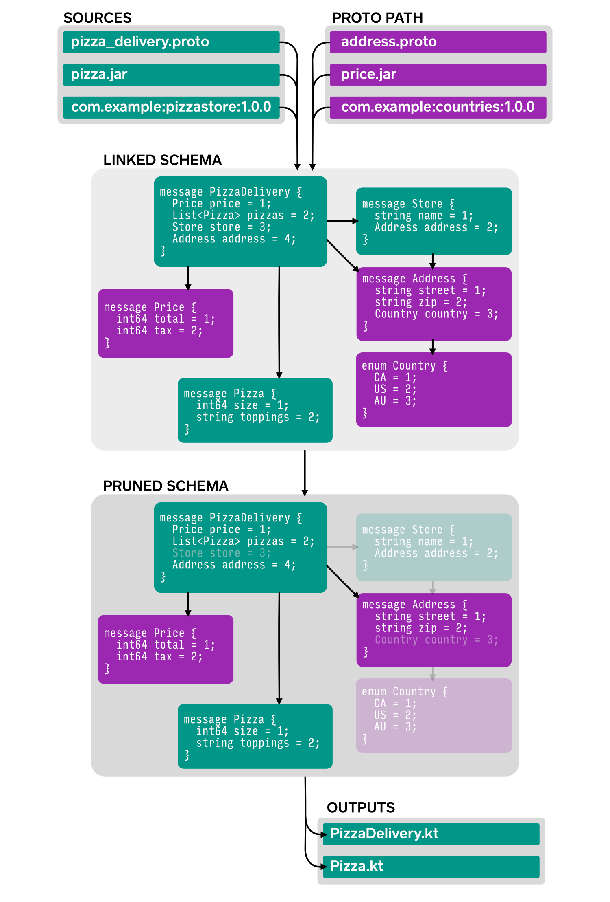

Wire Compiler & Gradle Plugin
=============================

Wire has two key components: a **compiler** that generates Kotlin and Java code at build time, and a
**runtime library** that supports the generated code when your program executes. The compiler is
very configurable; this guide explains its features and their use.

Getting Started
---------------

The best way to configure and execute the Wire compiler is via our [Gradle][gradle] plugin. It
requires Gradle 5.5 or newer.

A typical project has `.proto` files in the standard `src/main/proto` directory.

```
src/
  main/
    proto/
      com/
        example/
          pizza/
            pizza_delivery.proto
            pizza.proto
          sales/
            price.proto
            store.proto
          geo/
            address.proto
            country.proto
    kotlin/
      com/
        example/
          pizza/
            PizzaApp.kt
  test/
    kotlin/
      com/
        example/
          pizza/
            PizzaAppTest.kt
build.gradle
```

Because this project uses the standard location the plugin configuration is easy. Just a simple
block in `build.gradle`:

```groovy
plugins {
  id 'application'
  id 'org.jetbrains.kotlin.jvm'
  id 'com.squareup.wire'
}

wire {
  kotlin {
  }
}
```

The plugin will read the `.proto` schema definitions, validate them, link them, and generate Kotlin
code. It uses [KotlinPoet][kotlinpoet] internally to generate compact and legible source files.


Wire will generate files in `build/generated/source/wire`. It'll also register this directory as a
source directory for the project so the generated sources are compiled by the Kotlin compiler.

Replace `kotlin` with `java` to generate Java sources instead.


Inputs and Outputs
------------------

Wire can pull source `.proto` schema definitions from a local directory, a local `.jar` file, or an
external artifact specified with [Maven coordinates][maven_coordinates].

```groovy
wire {
  sourcePath {
    srcDir 'src/main/protos'
  }

  sourcePath {
    srcJar 'lib/pizza-protos.jar'
  }

  sourcePath {
    srcJar 'com.example.pizza:pizza-protos:1.0.0'
  }

  ...
}
```

If your resource or directory contains more `.proto` files than you need to compile you can
constrain the inputs to specific files:

```groovy
wire {
  sourcePath {
    srcDir 'src/main/protos'
    include 'com/example/pizza/pizza_delivery.proto'
    include 'com/example/pizza/pizza.proto'
  }
}
```

Wildcards (with two stars) are also accepted:

```groovy
wire {
  sourcePath {
    srcDir 'src/main/protos'
    include 'com/example/pizza/**'
  }

  ...
}
```

Wire can emit both Java and Kotlin in the same build. Use `includes` to specify which types are
emitted for a target language; subsequent languages will emit what's left over.

```groovy
wire {
  ...

  kotlin {
    // Kotlin emits the matched types only.
    includes = ['com.example.pizza.*']
  }
  java {
    // Java gets everything else!
  }
}
```

Note that sources are specified as file system paths (slash delimiter) and targets are specified as
Proto type names (dot delimiter).


You may also specify targets with excludes. If you have both includes and excludes, excludes take
precedence.

```groovy
wire {
  ...

  kotlin {
    // Kotlin emits everything but sales and geo packages.
    excludes = ['com.example.sales.*', 'com.example.geo.*']
  }
  java {
    // Java gets those because they're left over.
  }
}
```

Wire will print a warning if any name in includes or excludes is unused.

When configuring Wire you must use the package name from the `.proto` file's `package` declaration.
The `option java_package` name is not used for Wire configuration.


Proto Path for Libraries
------------------------

Large projects may span multiple modules. To support this Wire has a 'proto path'. The `.proto`
schema files on this path are used for linking and validation, but they do not yield files in the
generated output.

The proto path supports the same inputs as the proto path: directories, `.jar` files, and Maven
coordinates. Similarly, the proto path may be filtered with `include`.

```groovy
wire {
  protoPath {
    srcDir 'src/main/address-protos'
  }

  protoPath {
    srcJar 'lib/price.jar'
  }

  protoPath {
    srcJar 'com.example:countries:1.0.0'
    include 'com/example/geo/country.proto'
  }

  ...
}
```

The source path and proto path are linked together but only types on the source path are generated.




Pruning
-------

For mobile projects it's easy to generate a lot of unnecessary code. For example, a `.proto` schema
might support types for obsolete features.

General-purpose code-shrinking tools like [R8][r8] and [ProGuard][proguard] have difficulty
shrinking Wire-generated sources because the `encode()` and `decode()` functions still use them.
Instead, Wire offers its own code shrinker to eliminate unwanted declarations early.

Use `prune` to precisely eliminate an unwanted type or member. These will be eliminated along with
all references to them.

```groovy
wire {
  ...

  prune 'com.example.store.Store'
  prune 'com.example.geo.Country'

  ...
}
```



Alternately you may prefer to specify what to keep, pruning everything not reachable from that set.

```groovy
wire {
  ...

  root 'com.example.pizza.PizzaDelivery'

  ...
}
```


Customizing Output
------------------

### Java

Here's an exhaustive Java configuration. Booleans are shown with their non-default behavior.

```groovy
wire {
  java {
    // Proto types to include generated sources for. Types listed here will be
    // generated for this/ target and not for subsequent targets in the task.
    //
    // This list should contain package names (suffixed with `.*`) and type names
    // only. It should not contain member names.
    includes = ['com.example.pizza.*']

    // Proto types to excluded generated sources for. Types listed here will not
    // be generated for this target.
    //
    // This list should contain package names (suffixed with `.*`) and type names
    // only. It should not contain member names.
    excludes = ['com.example.sales.*']

    // True if types emitted for this target should not also be emitted for other
    // targets. Use this to cause multiple outputs to be emitted for the same input
    // type.
    exclusive = false

    // Directory to emit to.
    out "${buildDir}/custom"

    // True for emitted types to implement android.os.Parcelable.
    android = true

    // True to enable the androidx.annotation.Nullable annotation where applicable.
    androidAnnotations = true

    // True to emit code that uses reflection for reading, writing, and toString
    // methods which are normally implemented with generated code.
    compact = true
  }
}
```

### Kotlin

Here's an exhaustive Kotlin configuration. Booleans and enums are shown with their non-default
behavior.

```groovy
wire {
  kotlin {
    // Proto types to include generated sources for. Types listed here will be
    // generated for this/ target and not for subsequent targets in the task.
    //
    // This list should contain package names (suffixed with `.*`) and type names
    // only. It should not contain member names.
    includes = ['com.example.pizza.*']

    // Proto types to excluded generated sources for. Types listed here will not
    // be generated for this target.
    //
    // This list should contain package names (suffixed with `.*`) and type names
    // only. It should not contain member names.
    excludes = ['com.example.sales.*']

    // True if types emitted for this target should not also be emitted for other
    // targets. Use this to cause multiple outputs to be emitted for the same input
    // type.
    exclusive = false

    // Directory to emit to.
    out "${buildDir}/custom"

    // True for emitted types to implement android.os.Parcelable.
    android = true

    // True for emitted types to implement APIs for easier migration from the Java
    // target.
    javaInterop = true

    // `suspending` to generate coroutines APIs that require a Kotlin coroutines context.
    // `blocking` to generate blocking APIs callable by Java and Kotlin.
    rpcCallStyle = 'blocking'

    // `client` to generate interfaces best suited to sending outbound calls.
    // `server` to generate interfaces best suited to receiving inbound calls.
    rpcRole = 'server'

    // True for emitted services to implement one interface per RPC.
    singleMethodServices = true
  }
}
```

### Proto

Here's an exhaustive Proto configuration. You can use this target to generate a pruned proto schema,
or to pretty-print one. Note that even with multiple outputs set, the proto target will always emit
all types, all services, and all extensions of the schema.

```groovy
wire {
  proto {
    // Directory to emit to.
    out "${buildDir}/custom"
  }
}
```

 [gradle]: https://gradle.org/
 [kotlinpoet]: https://github.com/square/kotlinpoet
 [maven_coordinates]: https://maven.apache.org/pom.html#Maven_Coordinates
 [r8]: https://developer.android.com/studio/build/shrink-code
 [proguard]: https://www.guardsquare.com/en/products/proguard
